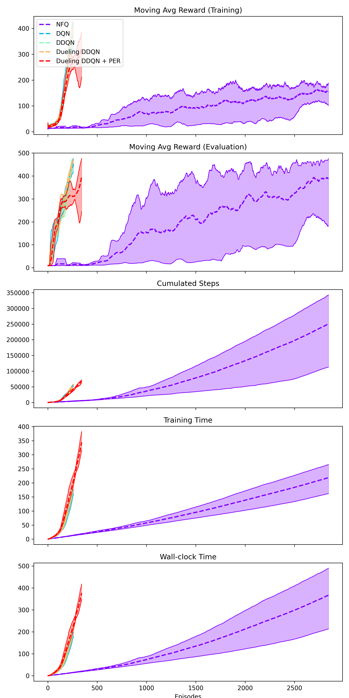
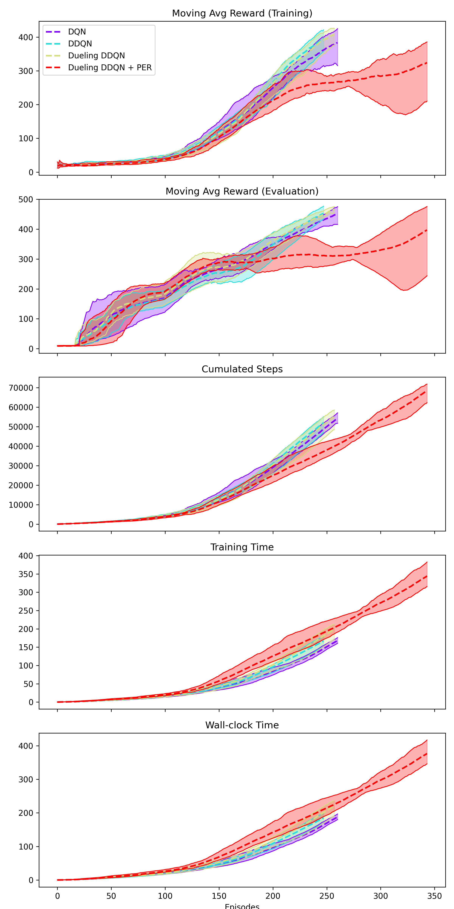
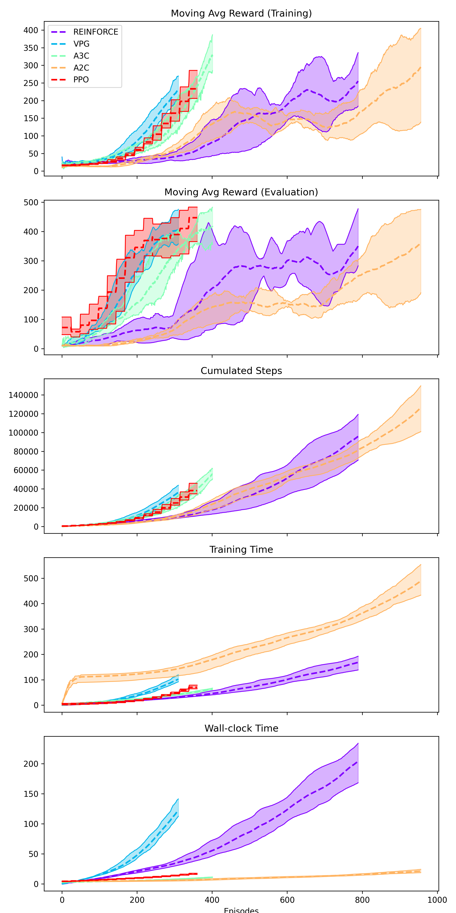
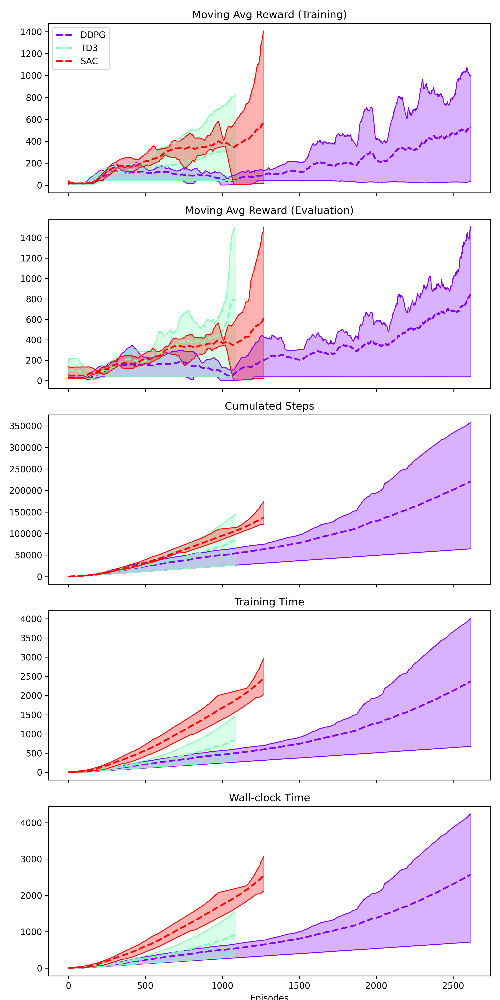

# Deep Reinforcement Learning Examples

## Installation

This project is implemented on Pipenv environment. You can refer to Pipfile for information on the package requirements.

```
git clone https://github.com/DoHunKim1215/DeepRL.git
pipenv install
pipenv shell
```

## Training

Before you start training agents, you can tune parameters in `/training` folder according to DRL method and environment.

```
python3 train.py --model_name=PPO --env_name=LunarLander-v3
```

## Experiment results

### Comparison of value-based methods for [CartPole-v1](https://gymnasium.farama.org/main/environments/classic_control/cart_pole/)

* Including NFQ



* Excluding NFQ



### Comparison of policy-based and actor-critic methods for [CartPole-v1](https://gymnasium.farama.org/main/environments/classic_control/cart_pole/)



### Comparison of actor-critic methods for [Hopper-v5](https://gymnasium.farama.org/main/environments/mujoco/hopper/)



## Reference

* Grokking Deep Reinforcement Learning
  * Book: https://www.manning.com/books/grokking-deep-reinforcement-learning
  * Github: https://github.com/mimoralea/gdrl
* Gymnasium
  * Docs: https://gymnasium.farama.org/index.html
